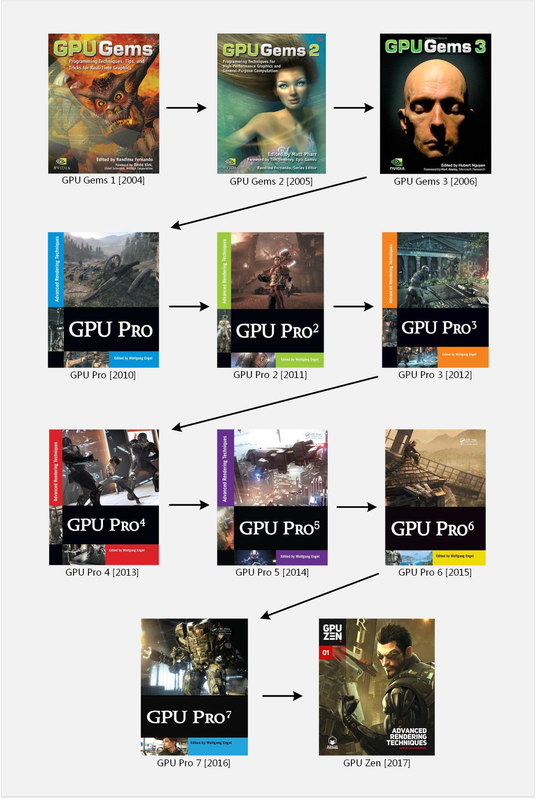

# GPU and Game Best Resouces

## Books collection
```bash
.
├── Computer Graphics
│   ├── 3D Graphics Rendering Cookbook A comprehensive guide to exploring rendering algorithms in modern OpenGL and Vulkan.pdf
│   ├── ComputerGraphicsPrinciplesPractice.pdf
│   ├── Fundamentals of Computer Graphics, Fourth Edition.pdf
│   ├── Graphics Shaders-Theory and Practice.pdf
│   ├── Interactive Computer Graphics.pdf
│   ├── Mathematics for 3D Game Programming and Computer Graphics, Third Edition.pdf
│   ├── OpenGL Insights.pdf
│   └── Physically Based Rendering, Third Edition From Theory to Implementation.pdf
├── GPU
│   └── Mobile 3D Graphics SoC From Algorithm to Chip.pdf
├── GPU Gems
│   ├── GPU Gems.chm
│   ├── GPU Gems2.chm
│   └── GPU Gems3.chm
├── GPU Pro
│   ├── GPU Pro 1.pdf
│   ├── GPU Pro 2.pdf
│   ├── GPU Pro 3.pdf
│   ├── GPU Pro 4.pdf
│   ├── GPU Pro 5.pdf
│   ├── GPU Pro 6.pdf
│   └── GPU Pro 7.pdf
├── GPU Pro 360
│   ├── GPU Pro 360 Guide to 3D Engine Design.pdf
│   ├── GPU Pro 360 Guide to GPGPU.pdf
│   ├── GPU Pro 360 Guide to Geometry Manipulation.pdf
│   ├── GPU Pro 360 Guide to Image Space.pdf
│   ├── GPU Pro 360 Guide to Lighting.pdf
│   ├── GPU Pro 360 Guide to Mobile Devices.pdf
│   ├── GPU Pro 360 Guide to Rendering.pdf
│   └── GPU Pro 360 Guide to Shadows.pdf
├── GPU Zen
│   ├── GPU Zen 2.pdf
│   └── GPU Zen.pdf
├── GameEngine
│   ├── Game Engine Architecture CN.pdf
│   ├── Game Engine Architecture by Jason Gregory.pdf
│   ├── Mathematics for 3D Game Programming and Computer Graphics, Third Edition.pdf
│   └── gems
│       ├── Game Engine Gems 1.pdf
│       ├── Game Engine Gems 2.pdf
│       └── Game Engine Gems 3.pdf
├── Games Dev
│   ├── 20 Essential Games to Study.pdf
│   └── Unity
│       ├── Unity 2018 Shaders and Effects Cookbook Transform your game into a visually stunning masterpiece with over 70 recipes, 3rd Edition.pdf
│       ├── Unity 2020 By Example A project-based guide to building 2D, 3D, augmented reality, and virtual reality games from scratch, 3rd Edition.pdf
│       ├── Unity Game Development Cookbook Essentials for Every Game.pdf
│       └── Unity in Action Multiplatform game development in C, 3rd Edition.pdf
├── OpenGL
│   └── C++ Game Development By Example Learn to build games and graphics with SFML, OpenGL, and Vulkan using C++ programming.pdf
├── Ray Tracing
│   ├── Ray Tracing Gems High-Quality and Real-Time Rendering with DXR and Other APIs.pdf
│   └── Ray Tracing Gems II Next Generation Real-Time Rendering with Dxr, Vulkan, and Optix.pdf
├── Real-Time Rendering
│   ├── Real-Time Rendering 3rd Summary.pdf
│   ├── Real-Time Rendering, 3rd Edition.pdf
│   └── Real-Time Rendering, 4th Edition.pdf
└── Vulkan
    ├── Vulkan Programming Guide CN.pdf
    ├── Vulkan Programming Guide.pdf
    └── learning-vulkan.pdf
```

### GPU Gems/GPU Pro/GPU Zen经典系列：



- GPU Gems三部Nvida已经开放，链接地址：

    - [GPU Gems](https://developer.nvidia.com/gpugems/gpugems/contributors)

    - [GPU Gems2](https://developer.nvidia.com/gpugems/gpugems2/copyright)

    - [GPU Gems2](https://developer.nvidia.com/gpugems/gpugems3/contributors)

- **Source Code:**
    - [GPU-Gems-Book-Source-Code](https://github.com/bigzz/GPU-Gems-Book-Source-Code)
    - [GPU-Pro-Books-Source-Code](https://github.com/bigzz/GPU-Pro-Books-Source-Code)

- **优秀博文:**

    - [GPU精粹与Shader编程(一) 开篇 & 全系列11本书核心知识点总览](https://zhuanlan.zhihu.com/p/34917895)
    - [GPU精粹与Shader编程(二) 《GPU Gems 1》全书核心内容提炼总结 · 上篇](https://zhuanlan.zhihu.com/p/35974789)
    - [GPU精粹与Shader编程(三) 《GPU Gems 1》全书核心内容提炼总结 · 下篇](https://zhuanlan.zhihu.com/p/36499291)
    - [GPU精粹与Shader编程(四) 《GPU Gems 2》全书核心内容提炼总结 · 上篇](https://zhuanlan.zhihu.com/p/38411575)
    - [GPU精粹与Shader编程(五) 《GPU Gems 2》全书核心内容提炼总结 · 下篇](https://zhuanlan.zhihu.com/p/40288273)
    - [《GPU Gems 3》：真实感皮肤渲染技术总结](https://zhuanlan.zhihu.com/p/42433792)
    - [一篇文章带你读完《GPU Gems 3》](https://zhuanlan.zhihu.com/p/44671434)


## Real-Time Rendering 

在实时渲染和计算机图形学领域，《Real-Time Rendering》这本书一直备受推崇。有人说，它是实时渲染的圣经。这本书的世界观架构宏大，基本涵盖了计算机图形学的方方面面，可谓包罗万象。概念讲得清楚明了，有丰富的论文引用，可供作为工具书查阅，深入某细分领域继续学习使用。

- **宝藏主页：** [Real-Time Rendering Resources](https://link.zhihu.com/?target=http%3A//www.realtimerendering.com/)

- [Real-Time-Rendering-4th-Bibliography-Collection](https://github.com/bigzz/Real-Time-Rendering-4th-Bibliography-Collection)

- **优秀博文:**
    - [《Real-Time Rendering 3rd》 提炼总结(一) 全书知识点总览](https://zhuanlan.zhihu.com/p/26259772)

    - [《Real-Time Rendering 3rd》 提炼总结(二) 第二章 · 图形渲染管线 The Graphics Rendering Pipeline](https://zhuanlan.zhihu.com/p/26527776)

    - [《Real-Time Rendering 3rd》 提炼总结(三) 第三章 · GPU渲染管线与可编程着色器](https://zhuanlan.zhihu.com/p/26894962)

    - [《Real-Time Rendering 3rd》 提炼总结(四) 第五章 · 图形渲染与视觉外观 The Visual Appearance](https://zhuanlan.zhihu.com/p/27234482)

    - [《Real-Time Rendering 3rd》 提炼总结(五) 第六章 · 纹理贴图及相关技术](https://zhuanlan.zhihu.com/p/27551369)

    - [《Real-Time Rendering 3rd》 提炼总结(六) 第七章 · 高级着色：BRDF及相关技术](https://zhuanlan.zhihu.com/p/28059221)

    - [《Real-Time Rendering 3rd》 提炼总结(七) 第七章续 · 延迟渲染(Deferred Rendering)的前生今世](https://zhuanlan.zhihu.com/p/28489928)

    - [《Real-Time Rendering 3rd》 提炼总结(八) 第九章 · 全局光照:光线追踪、路径追踪与GI技术进化编年史](https://zhuanlan.zhihu.com/p/29418992)

    - [《Real-Time Rendering 3rd》 提炼总结(九) 第十章 · 游戏开发中基于图像的渲染技术总结](https://zhuanlan.zhihu.com/p/30345339)

    - [《Real-Time Rendering 3rd》 提炼总结(十) 第十一章 · 非真实感渲染(NPR)相关技术总结](https://zhuanlan.zhihu.com/p/31194204)

    - [《Real-Time Rendering 3rd》 提炼总结(十一) 第十四章 : 游戏开发中的渲染加速算法总结](https://zhuanlan.zhihu.com/p/32300891)

    - [《Real-Time Rendering 3rd》 提炼总结(十二) 渲染管线优化方法论：从瓶颈定位到优化策略](https://zhuanlan.zhihu.com/p/32928016)

    - [《Real-Time Rendering 3rd》提炼总结完结篇：系列合集电子书PDF下载&实时渲染知识网络图谱&新系列预告](https://zhuanlan.zhihu.com/p/34207965)


